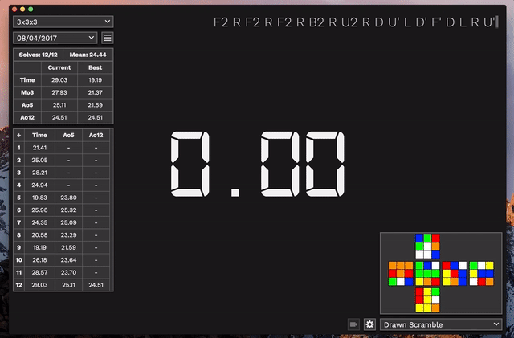
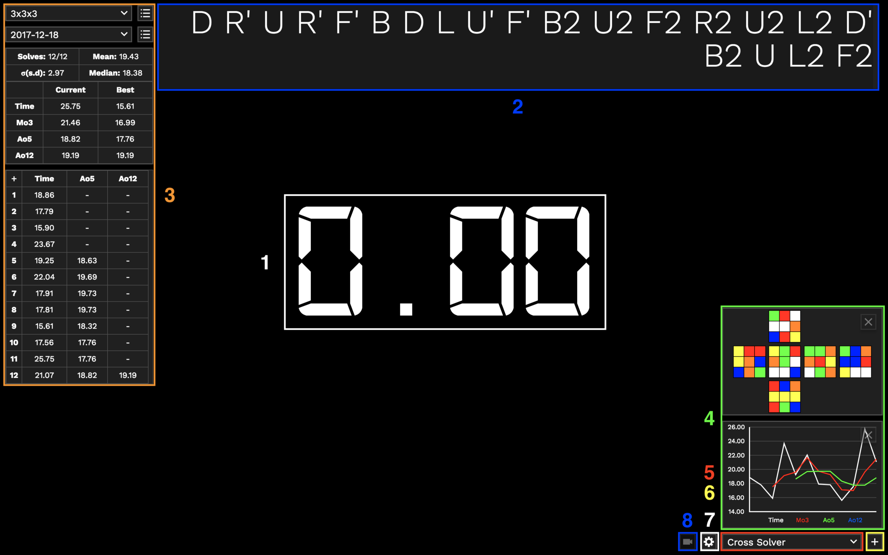
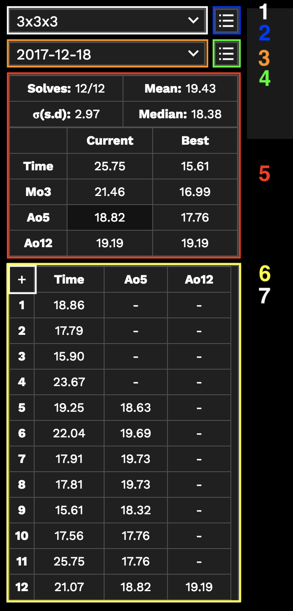

# Introduction

Block Keeper is a cross platform, desktop cubing timer. Block Keeper provides an event based session system with an elegant interface to provide relevant statistics and tools for speedcubing.

Main Features:

- Cross platform support, Windows, MacOS and Linux
- 100% offline and no Java required
- Event based session organisation
- Simple and stylish interface with multiple themes
- Scrambler for all WCA events
- WCA inspection support with voice announcements
- Event and session graphs
- Video recorder to view and save last solve
- Stackmat support
- Session import and export

If you encounter any bugs, issues or want to suggest any improvements, please let me know so I can make Block Keeper even better. You can contact me on Twitter [@dmcneil_](https://twitter.com/dmcneil_) or email [dallas@dallasmcneil.com](mailto:dallas@dallasmcneil.com).

## System Requirements

Block Keeper uses [Electron](http://electron.atom.io) and should run on all [supported platforms](https://github.com/electron/electron/blob/master/docs/tutorial/supported-platforms.md).

* Windows 7 or higher (32 and 64 bit)
* MacOS 10.9 or higher (64 bit only)
* Linux (32 bit, 64 bit and armv7, untested, see supported platforms above)

## Installation

### Windows

Block Keeper can be launched through `Block Keeper.exe`. It is recommended you place the `Block Keeper` folder in a permanent location and create a shortcut to `Block Keeper.exe` and place it wherever you would like. Save data and preferences are stored in `Users/YourName/AppData/Roaming/Block Keeper` or `%APPDATA%`. You may need to enable hidden folders to access them.

### MacOS

Block Keeper is a standalone application and can be run from anywhere. You can place `Block Keeper.app` wherever you want (Applications folder is recommended). Save data and preferences are stored in `/Users/YourName/Library/Application Support/Block Keeper`.

### Linux

Block Keeper can be launched through the `Block Keeper` executable file. Save data and preferences are stored in `$HOME/.config` or `$XDG_CONFIG_HOME`.

## Interface

1. Timer: Displays the current time of a solve and the time of the last solve in addition to inspection countdown
2. Scramble: Displays a scramble for the current event and solve  
3. Stats and Times: See below for additional information
4. Tools: Provides additional information and tools. See the Tools section
5. Tool Select and Add: Used to select a tool and add it above
6. Preferences: Open preferences menu to view options. See the Preferences section
7. Video Preview: Open video menu to view and save recorder video. See the Video Record section

1. Event Select: Used to select the current event
2. Session Select: Used to select the current session
3. Edit Session: Toggles session options, allowing you to change the name of the current session, create a new session or delete the current session
4. Session Statistics
    * Solves: Number of valid solves (not including DNF solves) over number of solves.
    * Mean: Total time of all valid solves over the number of valid solves, a mean of all valid solves.
    * Median: Middle time of all valid solves in order.
    * Standard Deviation: Rough measure of average distance from mean time any  
    * Table of best and current solves in session. Expands to present best and current time, Mo3, Ao5, Ao12 and Ao100. Clicking any results will present the list of times and scrambles used to generate the result.
5. Records Table: Ordered table of records presenting times of solves. A `+` on the end of a time indicates a `+2` time penalty which is already added to the time and a `DNF` indicates a `DNF` penalty. Ao5 and Ao12 times are composed of the solve adjacent including the previous 4 and 11 solves respectively. A `-` indicates that there are not enough solves to calculate a Ao5 or Ao12. Clicking any average results will present the list of times and scrambles used to generate the average.
6. Add Time: Shows dialog with option to add custom time and scramble to session
7. Solve Details: Hovering over a time will present the scramble used for the solve with options to change the penalty or delete the solve completely

## Keyboard and Menu Shortcuts

*NOTE: On MacOS, the `CTRL` key is replaced with the `Command` Key.*

### Timer

| Keys               | Description                        |
|--------------------|------------------------------------|
| `CTRL + 1`         | Set last solves result to OK       |
| `CTRL + 2`         | Set last solves result to +2       |
| `CTRL + 3`         | Set last solves result to DNF      |
| `CTRL + T`         | Add new time                       |
| `CTRL + Backspace` | Delete last solve                  |
| `CTRL + N`         | Create new session                 |
| `CTRL + S`         | Generate a new scramble            |
| `CTRL + E`         | Edit current Session               |
| `CTRL + R`         | View video recording of last solve |

### Window

| Keys               | Description          |
|--------------------|----------------------|
| `CTRL + W`         | Close Block Keeper   |
| `SHIFT + CTRL + F` | Toggle fullscreen    |
| `CTRL + M`         | Minimise/hide window |

### MacOS Specific

| Keys                   | Description        |
|------------------------|--------------------|
| `Command + ,`          | Open preferences   |
| `Command + H`          | Hide window        |
| `Command + Option + H` | Hide other windows |
| `Command + Q`          | Quit Block Keeper  |

## Timer Operation

The timer is inactive between solves and will present the time of your previous solve. Activating the timer and beginning a solve is different depending on a number of factors.

### Timer Key(s)

By default, the `spacebar` is the timer key. By pressing and holding the `spacebar` down the timer will turn red. Releasing the key before it has turned green will cancel the timer. When the timer is green, it is ready. Releasing the `spacebar` will begin the timer and your solve.

An alternative is to use split keys to operate the timer. By default they are `Z` and `/` but can be changed in preferences. Pressing and holding each key will show an indicator on the left and right side of the window. Once both keys are down, the timer will turn red. If one or both keys are released before the timer turns green, the timer will cancel. Once it turns green, releasing one or both of the keys will begin the timer and your solve.

### WCA Inspection

With inspection enabled, pressing and holding the timer key(s) will turn the timer immediately green. Upon releasing the key(s), inspection will begin. The timer will turn yellow and countdown from 15 to 0 seconds. With inspection announcements enabled, after 8 seconds and 12 seconds have passed, a voice will announce the current time of the inspection. To end the inspection and start the timer, follow the timer procedure above.

If 15 seconds pass before the timer is started, a `+2` time penalty will be indicated and added. If 17 seconds pass, a `DNF` penalty will be indicated and added. This is in compliance with [WCA regulations](https://www.worldcubeassociation.org/regulations/).

### Stopping or Cancelling the Timer

Upon completing your solve, pressing any key (excluding the Escape key) will stop the timer. Your time will be presented and be added to the records table. 

Pressing Escape before the timer begins will cancel the timer. Pressing Escape while the timer is timing will stop the timer but set the result of the time to `DNF`.

## Sessions

Block Keeper divides sessions into event categories. Selecting an event from the event dropdown will show a list of it's sessions below in a separate dropdown. All sessions created will be added to the current event. A scramble for the current event will also be shown. 

In this system, every session belongs to a specific event, keeping them organised and providing the correct scramble for every solve. 

Everyone chooses to use sessions differently, however, with this system it allows for many more sessions to be created and used effectively. As an example, you could create a session each day to record your times. Your more than free to use sessions however you choose.

## Video Record

After enabling Video Record Solves in preferences, your webcam or attached camera will be used to record your solves. Upon starting the timer, the camera will begin recording, until the timer is stopped. There is also the option to record inspection and just after the solve. After a recording has been made, the video can be viewed through the video record button in the bottom right corner. The video can also be saved from here as a `.webm` file. 

**IMPORTANT:** Only the most recent solve is available to view and save. When you begin another solve, the previous recorded video will be deleted. **If you want to view/save your solve, do so before you start your next solve.**
 
## Tools

Tools offer additional visual information and functionality. After selecting a tool to add form the selection menu, click the plus button to add the tool. Multiple tools can be added. To remove any tool, press the cross button on it.

* Distribution: Shows a histogram of times within the currently selected session, showing the number of times within certain ranges.
* Drawn Scramble: Shows the current scramble for the current event applied to a solved puzzle. Some events such as Skewb and MBLD are not supported.
* Event Statistics: Shows a table of current and best time, Mo3, Ao5, Ao12 and session means for the current event.
* Event Trend: Shows a trend-line of session stats within the currently selected event for best time, best Ao5 and mean. This shows your progress in an event.
* Metronome: Presents a metronome which can be started, stopped and adjusted to a set tempo. This can be used while timing or not.
* Session Trend: Shows a trend-line of record stats within the currently selected session for time, Mo3, Ao5 and Ao12. This shows your progress through a session.

## Preferences

### General

* Time Detail: Number of decimal points to show for times throughout the application
* Format Time: Times shown throughout the application will have a format of `mm:ss` rather than just seconds (e.g `1:34.23` instead of `94.23`)
* Video Record Solves: Enables an attached webcam to video record a solve for viewing and saving after. See the Video Record section
* Record Inspection: Include inspections and just after a solve while video recording.
* Video Autosave Location: Automatically saves recorded videos to the specified folder. Leave empty to not autosave.
* Display Scrambles in Lists: Include the scramble for a solve in any exported times.

### Timer

* Inspection Announcements: Voice announcements at 8s and 12s through WCA inspection (WCA inspection must be enabled)
* Timer Start Delay: Delay in seconds between keys being pressed and timer turning green and becoming ready.
* Hide Timer While Solving: Current time during solve is replaced with `solve`, hiding the time
* WCA Inspection: Enable WCA inspection before solve. See the Timer Operation section
* Use Mouse for Timer: Use primary mouse button like `spacebar` to control the timer by clicking on timer
* Split Timer Controls: Use 2 specific keys rather than the `spacebar` to operate the timer. See the Timer Operation section
* Stop Timer with Split Keys: Require both split keys to be pressed to stop the timer rather than any key
* OH Split Keys: Enable split keys for the 3x3x3 OH event and require one key to be held down during a solve or receive a `DNF` penalty
* Use Stackmat Timer: Use an external Stackmat Timer as input. May not connect if the timer is not plugged in before Block Keeper is opened. Try restarting if Block Keeper does not recognise your timer. For a guide on connecting Stackmat Timers to computers (specifically Macs) see [here](https://www.speedsolving.com/forum/threads/connecting-stackmat-timers-with-macs.64052/)

### Interface

* Announce Best Time: When best time for event is beaten, displays `New Best Time!` under timer and causes confetti to fall.
* Scramble Font Size: Set the arbitrary font size of scrambles presented
* Scramble Text Alignment: Set text alignment of scramble text to left, right of center.
* Background Image: Specify a path to an image file which will be shown in the background. Image can be a .png and include transparency to the standard background. Optionally the Select Image button will present a dialog to find an image using a file browser.
* Theme: Set color scheme of the application to predefined options or set to custom to use defined color scheme
* Custom Theme Colors: Specify the color of specific UI elements. All colors specified should be in hexadecimal form (e.g `#FF0000` for red), rgb form (e.g `rgb(255,0,0)` for red) or rgba form (e.g `rgba(255,0,0,0.5)` for red at half opacity). If any values have been input incorrectly, the default theme (Dark) will be used.

### Import/Export

* Block Keeper Export: Exports all session data to a JSON file.
* Block Keeper Import: Imports all session data from a compatible JSON file. This merges the data with pre-existing data.
* csTimer Import: Imports session times, results and scrambles from a csTimer JSON file. After selecting the file, you will need to specify the event you would like to place each session under. The first time and result for each session will be shown to identify the session. Use the event select dropdown to choose the event to import the session into. Repeat this for all sessions.
* CSV Export: Exports all session times into a flat CSV file, specifying the event, session, order, time, result and scramble for every record stored.
* Current Session as Pretty Text: Exports current session to a text file or copies text to clipboard specifying the currently selected sessions times and results along with session bests. This is designed to share and present.

Thanks for using Block Keeper!
